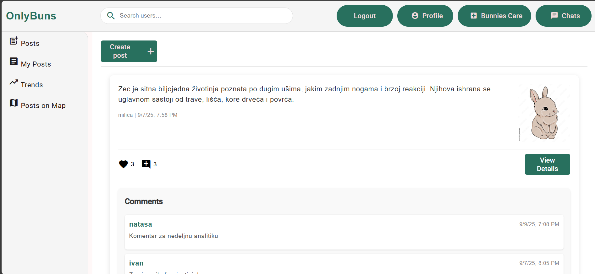
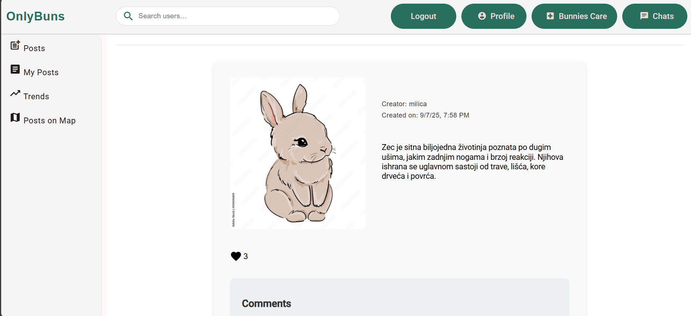
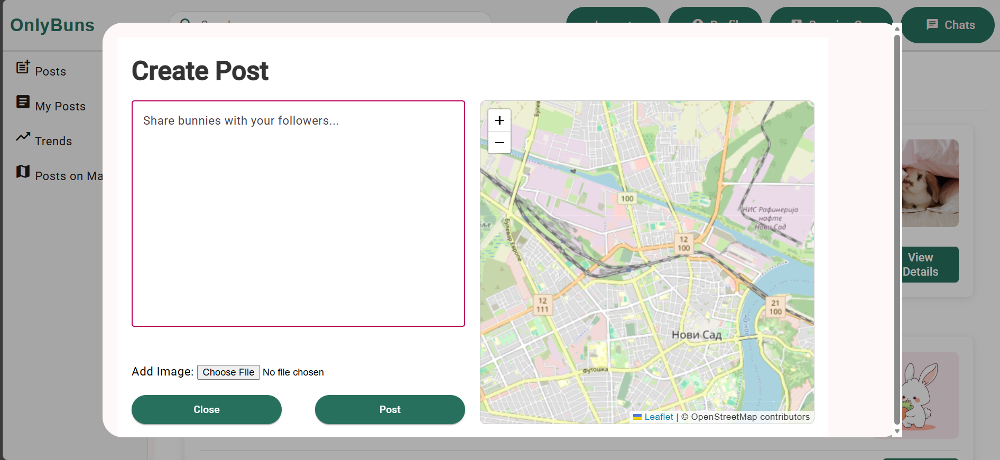
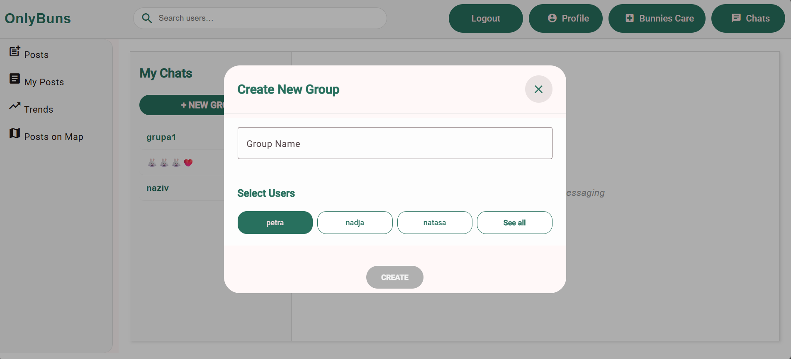
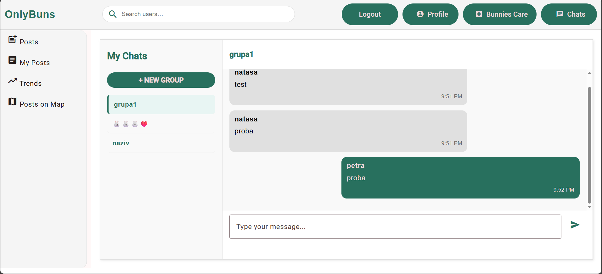
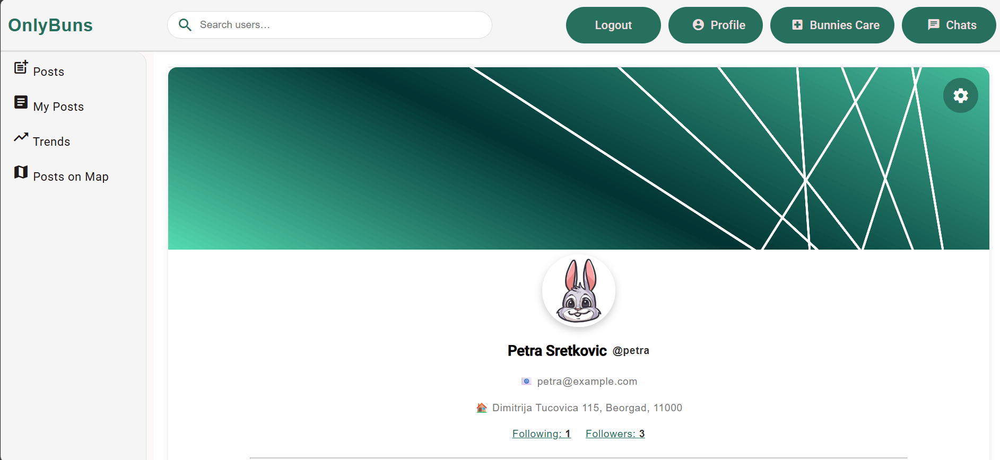
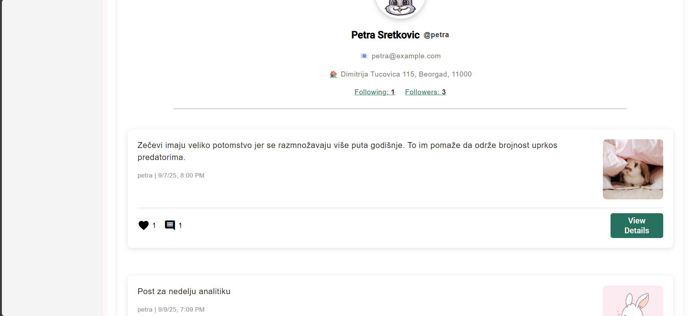
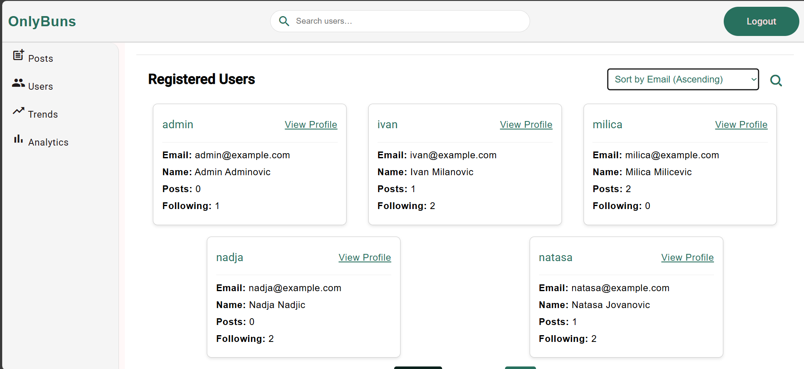

# Only Buns
Academic project for the Internet Software Architectures course at Faculty of Technical Sciences, University of Novi Sad 

## About Project 
OnlyBuns is a web application that represents a social network for rabbit enthusiasts, allowing users to share and browse photos of their pets, interact through likes and comments, follow other users to personalize their feed, and exchange messages via real-time chat implemented using WebSocket technology, including support for group chats with admin management and message history, with a backend built in Spring Boot, a frontend developed in Angular, PostgreSQL as the database, and additional features such as caching, rate limiting, load balancing, image compression, periodic removal of inactive accounts, and email-based account verification during registration.

## Used Tools and Libraries 
► IntelliJ IDEA   
► Visual Studio Code   
► pgAdmin   

### Authors
► Ana Edelinski  
► Masa Mastilovic  
► Tanja Rizovic

## Screenshots

